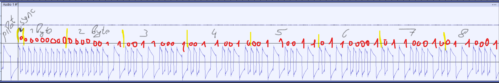

# wav2tap
Convert ZX Spectrum captured wav file to tap file.

## Wave format

Each block starts from PILOT pulses (1-2 ms)

Then 1 sync pulse (0.25-0.5 ms)

Then data, 7 bit first and 0 bit last.

Data pulses:
  - one = (0.5-1 ms)
  - zero = (0.25-0.5 ms))

## Tap file format

|LOWBYTE (blocksize) | HIGHBYTE (blocksize) | block bytes.... |

|LOWBYTE (blocksize) | HIGHBYTE (blocksize) | block bytes.... |

....

